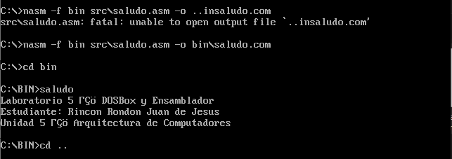
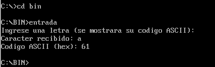
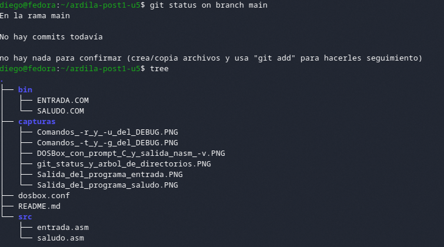

# Laboratorio DOSBox y Ensamblador x86

Unidad 5 — Arquitectura de Computadores
Post-Contenido 1

## Descripción

Este repositorio documenta la configuración de un entorno de desarrollo en DOSBox para la creación, ensamblado y ejecución de programas en lenguaje ensamblador x86 utilizando NASM, así como la verificación de su comportamiento mediante el depurador DEBUG de DOS. 

## Objetivo

Configurar un entorno funcional en DOSBox, desarrollar programas en ensamblador, ejecutarlos correctamente y analizar su comportamiento a bajo nivel. 

## Entorno de trabajo

* Sistema operativo anfitrión: Linux
* Emulador: DOSBox 0.74-3
* Ensamblador: NASM 2.x (para DOS)
* Editor de texto: Editor externo
* Control de versiones: Git

## Estructura del proyecto

```
apellido-post1-u5/
├── src/
├── bin/
├── capturas/
├── dosbox.conf
└── README.md
```

## Configuración de DOSBox

Se utilizó un archivo de configuración personalizado que permite:

* Montar automáticamente el directorio del proyecto como unidad C:
* Ajustar la velocidad de CPU para el ensamblador
* Mejorar la visualización mediante escalado de pantalla 

## Programa 1: salida de texto

Archivo: `src/saludo.asm`

Este programa muestra un mensaje en pantalla utilizando la interrupción INT 21h (función 09h).



## Programa 2: entrada de teclado

Archivo: `src/entrada.asm`

Este programa permite ingresar un carácter desde el teclado, mostrarlo en pantalla y presentar su código ASCII en hexadecimal.



## Depuración con DEBUG

Se utilizó DEBUG para analizar la ejecución del programa a nivel de instrucciones, inspeccionando registros y ejecutando paso a paso.


## Evidencia de checkpoints

Estructura del proyecto:



DOSBox con NASM funcionando:


## Resultados

* El entorno DOSBox fue configurado correctamente
* Los programas fueron ensamblados y ejecutados sin errores
* Se verificó el funcionamiento mediante DEBUG
* Se evidenció el uso correcto de interrupciones del sistema

## Conclusiones

El laboratorio permitió comprender el funcionamiento de programas en ensamblador dentro de un entorno emulado, así como el uso de herramientas de depuración para analizar el comportamiento interno del sistema.

## Autor

Diego Ardila
